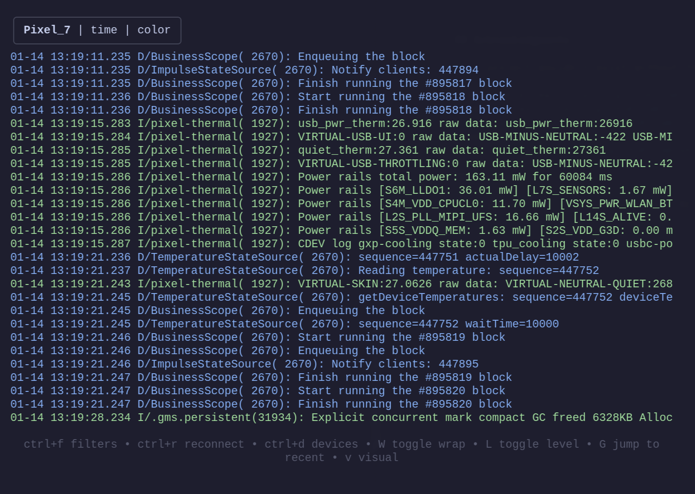
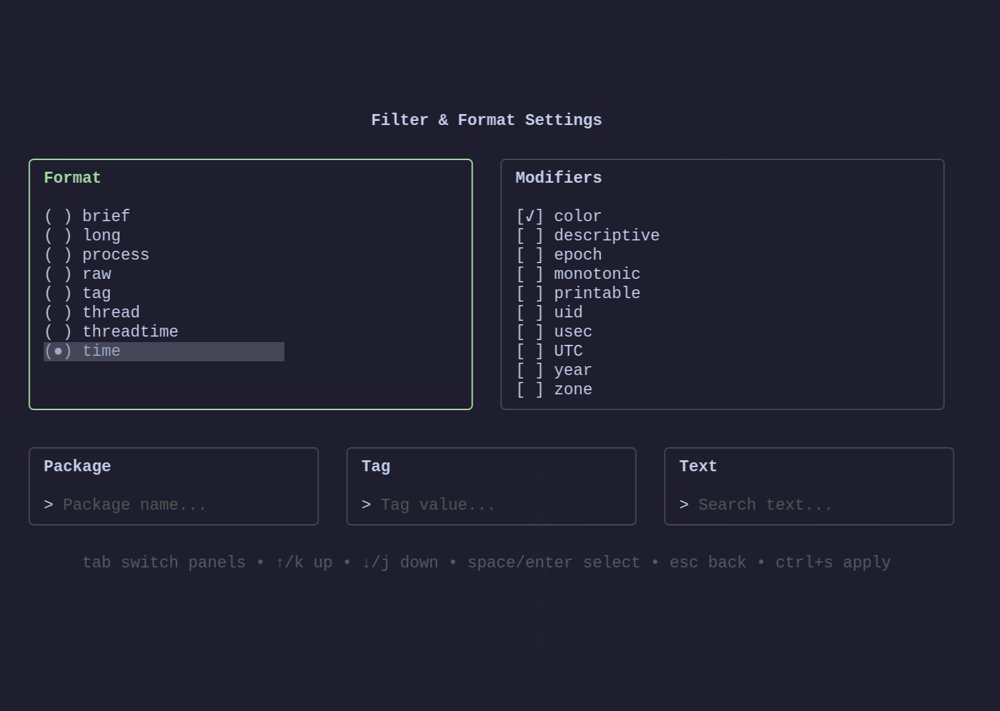
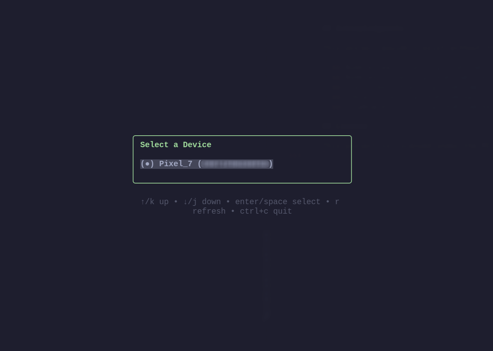
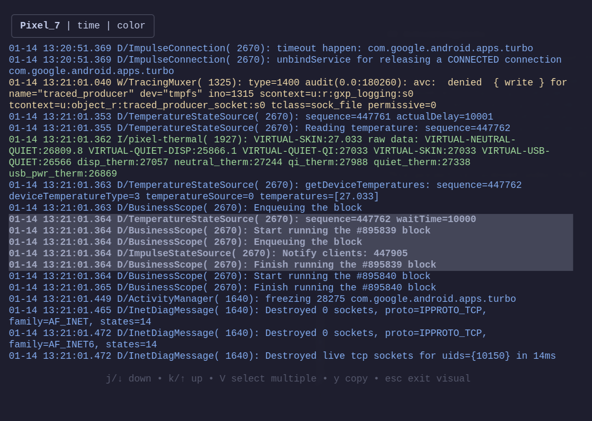

# lazylogcat

A TUI for viewing Android logcat logs.

<table>
  <tr>
    <td>
      <h3>Main Interface</h3>
      <p><i>Real-time logcat output</i></p>
      
    </td>
    <td>
      <h3>Settings</h3>
      <p><i>Configure log format, filters, and display preferences</i></p>
      
      <h3>Device Selection</h3>
      <p><i>Quick switching between connected Android devices and emulators</i></p>
      
      <h3>Visual Mode</h3>
      <p><i>Select and copy log entries with keyboard navigation</i></p>
      
    </td>
  </tr>
</table>

## Motivation

Reading Android logcat logs shouldn't require heavy tooling:
- **adb CLI is cumbersome**: Raw `adb logcat` is difficult to use
- **IDEs are resource-heavy**: Android Studio consumes significant memory just to view logs
- **Alternative editors lack logcat support**: Developers using Zed, VS Code, Neovim, or other editors have no integrated option

lazylogcat provides a lightweight, focused TUI for viewing and filtering logcat logs without the overhead.

## Prerequisites

- Go 1.24 or higher
- `adb` (Android Debug Bridge) installed and in PATH (see [ADB Installation Guide](https://developer.android.com/tools/adb))

## Installation

### Option 1: Install via go install (Recommended)

```bash
go install github.com/parfenovvs/lazylogcat@latest
```

**Important:** This installs the binary to your `$GOBIN` directory (or `$GOPATH/bin` if `GOBIN` is not set). Ensure this directory is in your `PATH`:

```bash
# Check where the binary is installed
go env GOBIN    # If empty, defaults to $(go env GOPATH)/bin

# Verify installation
which lazylogcat
```

If `lazylogcat` is not found, add the Go bin directory to your `PATH` environment variable.

### Option 2: Build from Source

```bash
# Clone the repository
git clone https://github.com/parfenovvs/lazylogcat.git
cd lazylogcat

# Build the binary
go build -o lazylogcat .

# Run directly
./lazylogcat

Optional: Move the binary to a directory in your PATH
```

## Usage

```bash
# Launch the TUI
lazylogcat

# Load custom configuration
lazylogcat --config config.json

# Enable debug logging (to .lazylogcat.log file in working directory)
lazylogcat --debug
```

## Configuration

lazylogcat can be customized using a JSON configuration file.

**Behavior:**
- No config file: Uses defaults
- Config file not found: Application exits with error
- Invalid JSON: Falls back to defaults (error logged with `--debug`)

### Configuration Format

```json
{
  "preferences": {
    // Log format (default: "time")
    // Options: "brief", "long", "process", "raw", "tag", "thread", "threadtime", "time"
    "log_format": "time",
    
    // Format modifiers (default: ["color"])
    // Options: "color", "descriptive", "epoch", "monotonic", "printable", 
    //          "uid", "usec", "UTC", "year", "zone"
    "log_modifiers": ["color"]
  },
  "session": {
    "device_id": "emulator-5554",      // Android device ID
    "package_name": "com.example.app", // Filtered package
    "log_tag": "MainActivity",         // Filtered tag (exact match)
    "log_text": "error"                // Text search filter
  }
}
```

## Acknowledgments

This project wouldn't exist without these incredible open source projects:

- **[Bubble Tea](https://github.com/charmbracelet/bubbletea)** by Charm
- **[Bubbles](https://github.com/charmbracelet/bubbles)** by Charm
- **[Lip Gloss](https://github.com/charmbracelet/lipgloss)** by Charm
- **[Cobra](https://github.com/spf13/cobra)** by spf13
- **[clipboard](https://github.com/atotto/clipboard)** by atotto

## License

This project is licensed under the MIT License - see the [LICENSE](LICENSE) file for details.
